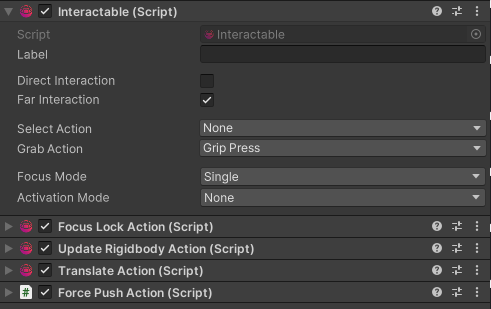

# How To Write Custom Interaction Behaviours?

If the default set of `Interaction Behaviour`s does not suffice, you can easily add new useful behaviours for your
`Interactable`s! The system is designed to be extendible and can be used to implement all kinds of specific app or game
behaviour.

## Writing Your First Interaction Behaviour

Create a new script in your project and name it `ForcePushBehaviour`:


Double click it to open it in your favourite code editor. You are now looking at an empty `MonoBehaviour`.
Clean it up and remove the default MonoBehaviour callbacks:

```cs
using UnityEngine;

public class ForcePushBehaviour : MonoBehaviour
{
    
}
```

Next we need to make sure that the component inherits `BaseInteractionBehaviour`.
Add

```cs
using RealityToolkit.Input.InteractionBehaviours;
```

to the top of your script file and then make `BaseInteractionBehaviour` the base class of your component.
This is what your component should look like now:

```cs
using RealityToolkit.Input.InteractionBehaviours;
using UnityEngine;

public class ForcePushBehaviour : BaseInteractionBehaviour
{
    
}
```

Next add a serialized private field to define the strength of your force push. Are you a Jedi Padawan just getting started
or a powerful Jedi Master? Also make sure to get a reference to the interactable's rigidbody in your awake callback. Since we know
the interaction behaviour sits on the interactable object it is safe to assume that there is a rigidbody. Every Interactable object
must have a rigidbody. Your script looks like this now:

```cs
using RealityToolkit.Input.InteractionBehaviours;
using UnityEngine;

public class ForcePushBehaviour : BaseInteractionBehaviour
{
    [SerializeField, Tooltip("The power of the force push executed on the object.")]
    private float forcePower = 10f;

    private new Rigidbody rigidbody;

    /// <inheritdoc/>
    protected override void Awake()
    {
        base.Awake();
        rigidbody = GetComponent<Rigidbody>();
    }
}
```

Alright, we are almost there. All that is left to do now is make the component push away the interactable when we
stop interacting with it. We will be using our custom behaviour together with some of the toolkit's default behaviours
to grab the object and move it around and then when we "drop it", our force push should kick in and do its job.

:::tip

Interaction Behaviours are meant to be combined where possible. Try combinging multiple behaviours to get the desired result.
That way we avoid monolithic behaviours that do a lot of things. Interaction Behaviours have a `Sorting Order` property that you can use
to adjust their execution order, if needed. By default they will execute in the same order as they are attached to the `GameObject`.

:::

Now back to work. Here is our completed `ForcePushBehaviour`:

```cs
using RealityToolkit.Input.Events;
using RealityToolkit.Input.InteractionBehaviours;
using RealityToolkit.Input.Interactors;
using UnityEngine;

public class ForcePushBehaviour : BaseInteractionBehaviour
{
    [SerializeField, Tooltip("The power of the force push executed on the object.")]
    private float forcePower = 10f;

    private new Rigidbody rigidbody;

    /// <inheritdoc/>
    protected override void Awake()
    {
        base.Awake();
        rigidbody = GetComponent<Rigidbody>();
    }

    /// <inheritdoc/>
    protected override void OnLastGrabExited(InteractionExitEventArgs eventArgs)
    {
        base.OnLastGrabExited(eventArgs);

        // This behaviour only works with controller based interactors.
        if (eventArgs.Interactor is IControllerInteractor controllerInteractor)
        {
            // We determine the direction of our force push using the interactor's position in the scene
            // and the interactable's position and normalize it.
            var forceDirection = (transform.position - controllerInteractor.GameObject.transform.position).normalized;

            // Scale by our configured force power.
            forceDirection = forcePower * forceDirection;

            // Finally add the force push to the rigidboy.
            rigidbody.AddForce(forceDirection, ForceMode.Impulse);
        }
    }
}
```

Note how we use the `OnLastGrabExited` interaction event callback to do our magic. This callback is raised when the last interactor has released
grab input on the interctable. You could also listen for another custom input action to do the actual push but to keep things simple here, we simply consider
dropping the object when we want to push it away.

Notice how we restrict the behaviour to only perform its duty if the interactor is a type of `IControllerInteractor` because those are represented by a `GameObject`
in the scene and thus have a position. We use that position to determine the direction of our force push.

## Using Your Behaviour

Create a primitive `GameObject`, such as a cube or sphere in your scene. Then attach the `Interactable` component to it and also the `FocusLockBehaviour`, `UpdateRigidbodyBehaviour`, `TranslateBehaviour` and the just created `ForcePushBehaviour`. Configure the input events on the `Interactable` and make it only react to far interaction for simplicity, since our custom behaviour is not designed to work with direction interaction. Your GameObject configuration should look similar to this:



:::tip

Once again, notice how we make use of the existing behaviours to perform the "telekinesis" aspect of our power.
The `FocusLockBehaviour` makes sure that the interactor focus is kept on the interactable while we are interacting with it. After that the `UpdateRigidbodyBehaviour`
makes sure the Rigidbody is configured properly to discard gravity while we are "force holding" the object. `TranslateBehaviour` performs the actual telekinesis and
last but not least our custom behaviour does the force push.

:::

Deploy to your device or use e.g. Quest Link to test using the editor and enjoy your new Jedi powers!