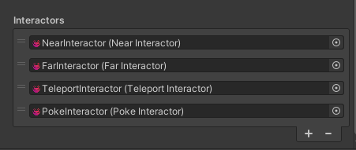

# How To Add Or Remove An Interactor?

`Interactor`s are added to a controller via the `ControllerProfile`. Select a profile and in the inspector at the bottom you'll find a list of configured Interactors.
Add or remove Interactors as you need, e.g. to make certain Interactors only available on target platform A and not on platform B.

