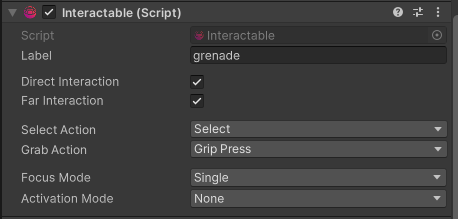

# How To Make A GameObject Interactable?

To make a `GameObject` interactable add the `Interactable` component to it.

Make sure the `Collider` and `Rigidbody` on the object is configured as you require it.
On the `Interactable` component you can configure whether the Interactable allows
interactions from a distance, direct or both. You can also define `Input Action`s to listen for
from `Interactor`s to perform select or grab interaction.

:::tip

All components of the interaction framework are documented extensively in code.
Make sure to take a look to understand the purpose of each setting.

:::

Congratulations! Your object is now interactable but it will not do anything when interacted with unless
you add `Interaction Behaviour`s to it. Keep on reading to learn about out of the box provided behaviours.