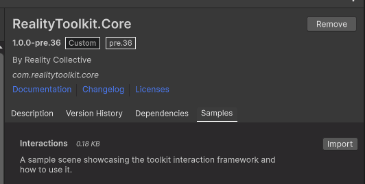

# Import Sample Via Package Manager

Use the Unity Package Manager to import a full sample scene containing various demo stations on interactions.
Explore the scene and the GameObjects within it, to learn how to achieve your desired interactions.

Select `Import` on the `RealityToolkit.Core` `Interactions` sample.

